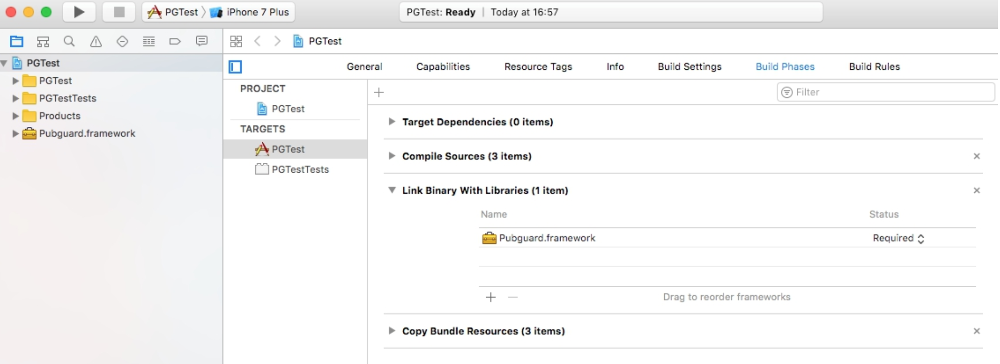
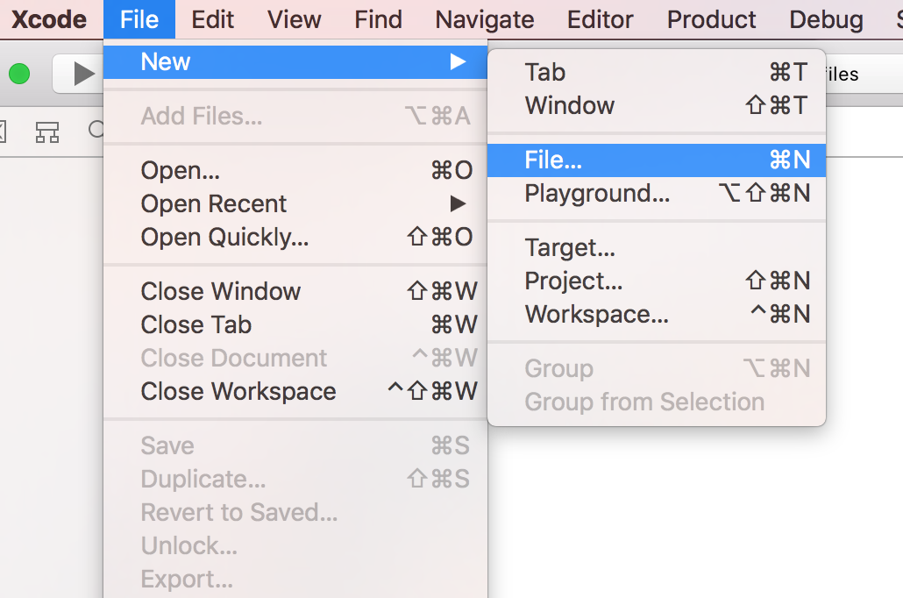
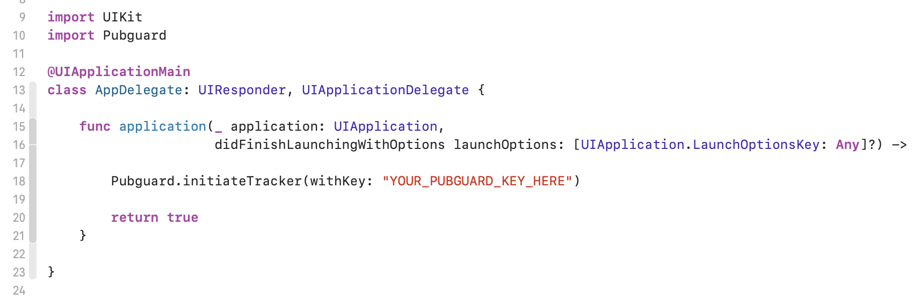

# Pubguard Library

A guide to installing Pubguard on your application, with instructions, demos and FAQs

The Pubguard Library is solution that monitors the advertising content flowing through your mobile app, protecting against unwanted content and optimising revenues.

The data from the library is then accessible via your account on the Pubguard interface where you can set up preferences, alerts and browse the gallery.

---

Table of contents
=================

<!--ts-->
* [Table of contents](#table-of-contents)
* [iOS](#ios)
* [Unity Plugin](#Unity-Plugin)
* [Change Log](#change-log)
* [Library Size](#library-size)
* [SDK support](#support)
* [Requirements](#requirements)
* [Versioning](#versioning)
* [License](#license)
<!--* [FAQs](https://github.com/bidstack-group/pubguardSDK/wiki/FAQs)-->

<!--te-->

# Getting Started

These instructions will enable you to get the Pubguard library running on your iOS/Unity app.

## Prerequisites

Before installing the pubguard library you will need an application key which is available from your account, in order to receive a key please signup from https://bidstack.pubguard.com or email support@pubguard.com. The key is used in both the iOS and Android installations.

```
pubguardKey = "xxxxxxxxxxxxxxxxxxx"
```

---

# iOS

The latest version of the iOS Pubguard Library is **1.0.0**

### Installing

There are 2 methods of installing the Pubguard framework:

#### Using cocoapods

Please add the following line to your Podfile (adding in your app key):

```
pod 'PubguardSDK', '~> 1.0.0'
```

Then run "pod install --repo-update"

#### Adding the library manually

Please request the Pubguard Library from support@pubguard.com which will have the key embedded in it.

Once received copy the Pubguard.framework into your Xcode project and add it to all targets that will link to Pubguard:


Add the Pubguard Library to Target > General > Embedded Binaries. If you add the framework to "embedded binaries", the framework will also be added to "Linked Frameworks and Libraries".




Download file [strip-frameworks.sh](strip-frameworks.sh) and put this file in root folder of your project.

In Project Navigator choose your project and go to "Build Phases" and in the top left corner find and press "add" button. Hit "New Run Script Phase" and choose new "Run Script".


Add the following Build script

```
bash "${SRCROOT}/${PROJECT_NAME}/strip-frameworks.sh"
```


Also in "Build Phases" add Pubguard framework in "Embed Frameworks".


#### Unity installation

Unity supports installation via cocoapods and manual installation. Framework must be installed in Xcode project, which you get after building Unity project for iOS platform.

##### cocoapods (Unity)

Please add the following line to your Podfile (adding in your app key):

```
pod 'PubguardSDK', :git => 'https://github.com/bidstack-group/pubguard-sdk-ios.git'
```

Then run "pod install --repo-update"

##### manual (Unity)

Manual installation is the same [instructions](#Adding the library manually).

### Initialising the Library

The Pubguard Library should be initialised once at app launch, Here's an example of how to call the init method in your AppDelegate:

#### Swift

The Pubguard Library is written in Obj-c so if your app is Swift please see the guide on adding a [bridging header](#Bridging Header).

```swift
*Example AppDelegate.swift*

import UIKit
import Pubguard
…

@UIApplicationMain
class AppDelegate: UIResponder, UIApplicationDelegate {

    var window: UIWindow?

        func application(_ application: UIApplication,
                         didFinishLaunchingWithOptions launchOptions: [UIApplicationLaunchOptionsKey: Any]?) -> Bool {

        // Initialize the Pubguard Library.
        Pubguard.initiateTracker(withKey: "YOUR_PUBGUARD_KEY_HERE")

        return true
    }

}
```

#### Objective-C

```objective-c
*Example AppDelegate.m (excerpt)*

#import "Pubguard/Pubguard.h"
…

@implementation AppDelegate

- (BOOL)application:(UIApplication *)application
didFinishLaunchingWithOptions:(NSDictionary *)launchOptions {

    // Initialize the Pubguard Library.
    [Pubguard initiateTrackerWithKey:@"YOUR_PUBGUARD_KEY_HERE"];
    return YES;
}

@end
```

#### Bridging Header

This is a quick guide explaining how to add a bridging header if you have built your app in Swift and are using the Pubguard Library.

Create a new file in your project:



Select 'header file' and name it Pubguard-Bridging-Header


### Update your Bridging Header File

Add **#import 'Pubguard/Pubguard.h'** to new header file, this will allow you to import the Pubguard Library in your Swift app


### Update your Build Settings to include the Bridging Header

In **Project Settings -> Build Settings** search for *"Swift Compiler - Code Generation"*  add the Bridging header to the line *Objective-C Bridging Header*


### That's it! You should now be able to access the library as normal:



#### Unity

As was mentioned earlier, pubguard installation and initialization must be in Xcode project, which you get after building Unity project for iOS platform. In this project find **UnityAppController.mm** file and find **application didFinishLaunchingWithOptions** function. Add ```[Pubguard initiateTrackerWithKey:@"YOUR_PUBGUARD_KEY_HERE"];```.

```objective-c
*Example UnityAppController.mm (excerpt)*

#import <Pubguard/Pubguard.h>
…

@implementation UnityAppController

- (BOOL)application:(UIApplication *)application
didFinishLaunchingWithOptions:(NSDictionary *)launchOptions {

    // Initialize the Pubguard Library.
    [Pubguard initiateTrackerWithKey:@"YOUR_PUBGUARD_KEY_HERE"];
    return YES;
}

@end
```


## Unity Plugin

The latest version of the Pubguard Plugin is **1.0.0**

Start with importing Pubguard Package. From the **Assets** menu, choose **Import Package**, plus the name of the package you want to import.


Select **Import** and Unity puts the contents of the package into a **Standard Asset** folder, which you can access from your **Project View**.


1. From **Project** tab, exapnd **Assets** folder and click on **Prefabs**.
2. Drag and Drop **Pubguard** plugin to the Project **Hierachy** list.
3. The **PubguardController** shoud appear in the **Hierachy** list as shown on the image below.


Click on the **PubguardControler** and from the **Inspector** tab enter the Pubguards's Application Key.

Check the [Prerequisites](#Prerequisites) section explaining how to obtain the Application Key.


The Pubguard plugin installation is now completed.

---

## Changelog


For all release notes and previous versions please see our [changelog](manual/changelog.md).

---

## Library Size

The Pubguard team understands the importance of having a small footprint and our library is optimised to be as lightweight as possible on both iOS and Android.

Here is a guide based based on our compiling with our test apps, please bear in mind the size may increase or reduce based on the amount of SDKs you use and the amount of shared dependancies.

|Dependancies| iOS   |
| ---- | ----- |
| Total |~140kb |

---

## Support

### Advertising SDK support

These are SDKs designed specifically for serving advertising content into your app, if you would like information on a version or vendor that is not on this list please email support@pubguard.com

| Company/Product | iOS SDK identifier | iOS versions |
| ------- | ----- | ------- |
| AdColony | | 4.1.4|
| AdMob | Google-Mobile-Ads-SDK | 7.57.0 |
| Amazon Mobile Ads | | |
| AppLovin | | |
| AppNexus | AppNexusSDK | 7.2 |
| Chartboost | | |
| Facebook Audience Network | FBAudienceNetwork | 5.8.0 |
| Fyber Marketplace |  |  |
| InMobi | InMobiSDK | 9.0.6 |
| ironSource | IronSourceSDK | 6.15.0.1 |
| MoPub |  | 5.14.0 |
| MoPub mediation - AdMob | |  |
| MoPub mediation - Unity | |  |
| One by AOL | MMAdSDK | 6.8.2|
| OpenX | | 4.8.1 |
| Rubicon Project | RFMAdSDK | 6.4.0|
| Smaato | | |
| Tapjoy | | 12.4.2 |
| Unity Ads | | 3.4.2 |
| Verizon | | 1.5.0 |
| Vungle | | 6.5.3 |

### Mediation Support

Mediation platforms or networks can be used to manage the various SDKs within your platform, although most platforms don't affect Pubguard's monitoring solution in any way if you do have a question please email support@pubguard.com to clarify.

| Mediator     | iOS   | Android |
| ------- | ----- | ------- |
| AATKit (addApptr)   | 2.65.34|    |
| DFP   | 7.31.0 |  |
| AppNexusSDK | 7.2 |    |
| MoPub | 5.11.0 | 5.10.0, 5.12.0 |

## Requirements

### iOS Requirements

+ iOS 9.0 and up
+ Xcode 11.0 and up

---

## Versioning

Please use the most up to date version at all times to ensure maximum support.

---

## License

*© 2019 Minimised Media Limited (Pubguard© 2019 All Rights Reserved)*
