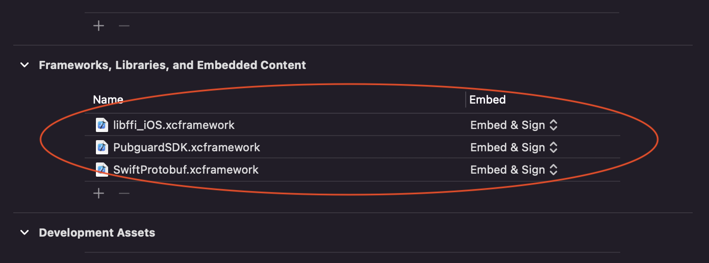

# Pubguard Library

A guide to installing Pubguard on your application, with instructions, demos and FAQs

The Pubguard Library is solution that monitors the advertising content flowing through your mobile app, protecting against unwanted content and optimising revenues.

The data from the library is then accessible via your account on the Pubguard interface where you can set up preferences, alerts and browse the gallery.

---

Table of contents
=================

<!--ts-->
* [Table of contents](#table-of-contents)
* [iOS](#ios)
* [Unity Plugin](#Unity-Plugin)
* [Change Log](#change-log)
* [Library Size](#library-size)
* [SDK support](#support)
* [Requirements](#requirements)
* [Versioning](#versioning)
* [License](#license)

<!--te-->

# Getting Started

These instructions will enable you to get the Pubguard library running on your iOS/Unity app.  
Android instructions can be found [here](https://github.com/bidstack-group/pubguard-sdk-android)

## Prerequisites

Before installing the Pubguard library you will need an application key,  please visit the [Pubguard Portal](https://dashboard.pubguard.com/) for more details.

---

# iOS

The latest version of the iOS Pubguard Library is **1.0.0**

### Installing

There are 2 methods of installing the Pubguard framework:

#### Using cocoapods

Please add the following line to your Podfile (adding in your app key):

```
pod 'PubguardSDK'
```

Then run "pod install --repo-update"

#### Adding the library manually

Please request the Pubguard Library Bundle from support@pubguard.com or clone the bundle from the git repository:
```
git clone https://github.com/bidstack-group/pubguard-sdk-ios.git
```

The Pubguard Bundle contains three frameworks: 
Pubguard.xcframework  
Frameworks/SwiftProtobuf.xcframeworks  
Frameworks/libffi-iOS.xcframeworks

Copy these three frameworks into your Xcode project and add them to all targets:


These three frameworks will appear in *Frameworks, Libraries, and Embedded Content* section.
Choose *Embed and Sign* for all the frameworks, as on the image below:




#### Unity installation

Unity supports installation via cocoapods and manual installation. Framework must be installed in Xcode project, which you get after building Unity project for iOS platform.

##### cocoapods (Unity)

Please ensure that your Podfile containing the following line:

```
pod 'PubguardSDK', '~> 1.0.0'
```

Then run "pod install --repo-update"

##### manual (Unity)

Manual installation is the same [instructions](#Adding the library manually).

### Initialising the Library

The Pubguard Library should be initialised once at app launch, Here's an example of how to call the init method in your AppDelegate:

#### Swift

The Pubguard Library contains the Swift Module.  
You only need to import that module, check the code example below:  

```swift
*Example AppDelegate.swift*

import UIKit
import Pubguard
…

@UIApplicationMain
class AppDelegate: UIResponder, UIApplicationDelegate {

    var window: UIWindow?

        func application(_ application: UIApplication,
                         didFinishLaunchingWithOptions launchOptions: [UIApplicationLaunchOptionsKey: Any]?) -> Bool {

        // Initialize the Pubguard Library.
        Pubguard.initiateTracker(withKey: "YOUR_PUBGUARD_KEY_HERE")

        return true
    }

}
```

#### Objective-C

```objective-c
*Example AppDelegate.m (excerpt)*

#import "Pubguard/PubguardSDK.h"
…

@implementation AppDelegate

- (BOOL)application:(UIApplication *)application
didFinishLaunchingWithOptions:(NSDictionary *)launchOptions {

    // Initialize the Pubguard Library.
    [Pubguard initiateTrackerWithKey:@"YOUR_PUBGUARD_KEY_HERE"];
    return YES;
}

@end
```

#### Unity

As was mentioned earlier, pubguard installation and initialization must be in Xcode project, which you get after building Unity project for iOS platform. In this project find **UnityAppController.mm** file and find **application didFinishLaunchingWithOptions** function. Add ```[Pubguard initiateTrackerWithKey:@"YOUR_PUBGUARD_KEY_HERE"];```.

```objective-c
*Example UnityAppController.mm (excerpt)*

#import <Pubguard/PubguardSDK.h>
…

@implementation UnityAppController

- (BOOL)application:(UIApplication *)application
didFinishLaunchingWithOptions:(NSDictionary *)launchOptions {

    // Initialize the Pubguard Library.
    [Pubguard initiateTrackerWithKey:@"YOUR_PUBGUARD_KEY_HERE"];
    return YES;
}

@end
```


## Unity Plugin

The latest version of the Pubguard Plugin is **1.0.0**

Start with importing Pubguard Package. From the **Assets** menu, choose **Import Package**, plus the name of the package you want to import.


Select **Import** and Unity puts the contents of the package into a **Standard Asset** folder, which you can access from your **Project View**.


1. From **Project** tab, exapnd **Assets** folder and click on **Prefabs**.
2. Drag and Drop **Pubguard** plugin to the Project **Hierachy** list.
3. The **PubguardController** shoud appear in the **Hierachy** list as shown on the image below.


Click on the **PubguardControler** and from the **Inspector** tab enter the Pubguards's Application Key.

Check the [Prerequisites](#Prerequisites) section explaining how to obtain the Application Key.


The Pubguard plugin installation is now completed.

---

## Changelog


For all release notes and previous versions please see our [changelog](ChangeLog.md).

---

## Support

### Advertising SDK support

These are SDKs designed specifically for serving advertising content into your app, if you would like information on a version or vendor that is not on this list please email support@pubguard.com

| Company/Product | iOS SDK identifier | SDK versions |
| ------- | ----- | ------- |
| AdColony | AdColony | 4.6.0 |
| AdMob | Google-Mobile-Ads-SDK | 8.4.0 |
| Amazon Transparent Ad Marketplace | AmazonPublisherServicesSDK | 3.4.6 |
| AppLovin | AppLovinSDK | 10.1.1 |
| Chartboost | ChartboostSDK | 8.4.1 |
| Fyber Marketplace | Fyber_Marketplace_SDK | 7.7.2 |
| InMobi | InMobiSDK | 9.1.1 |
| IronSource | IronSourceSDK | 7.1.6 |
| MoPub | mopub-ios-sdk | 5.17.0 |
| Smaato | smaato-ios-sdk | 21.6.12 |
| Unity Ads | UnityAds | 3.7.1 |
| Vungle | VungleSDK-iOS | 6.8.1 |


## Requirements

### iOS Requirements

+ iOS 12.1 and up
+ Xcode 12.2 and up

---

## Versioning

Please use the most up to date version at all times to ensure maximum support.

---

## License

*© 2021 Minimised Media Limited (Pubguard© 2019 All Rights Reserved)*
